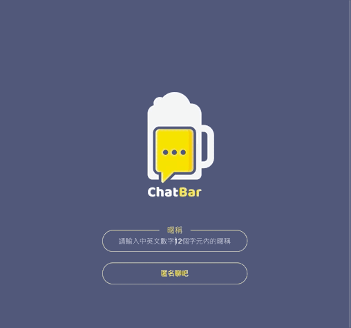
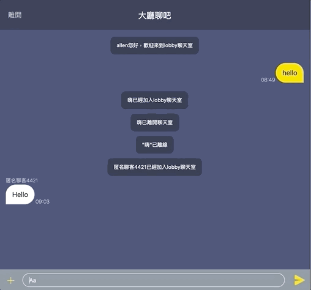
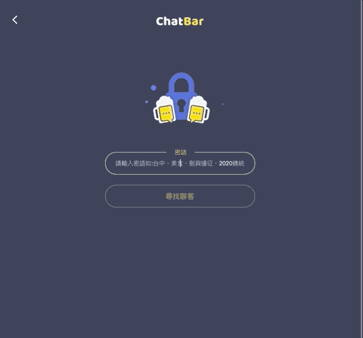

# ChatBar 匿名聊天室

[參考設計稿使用 Penny 的設計稿](https://challenge.thef2e.com/user/2232?schedule=4063#works-4063)

## 簡介

以 React.js 作為前端，並以 socket.io 實作隨機匹配的聊天室。

## 技術棧

React hook

react-router-dom

node.js

express

socket.io

## 使用導覽

1. 點擊網址後進入 loginPage 可以輸入暱稱或使用匿名聊天來進入聊天室，輸入之暱稱會在「大廳聊吧」顯示。

2. 進入 HomePage 後可選擇三種聊天方式，分別為「大廳聊吧」、「密語聊吧」、「隨緣聊吧」，並可點擊離開回到 LogingPage

3. 點擊「大廳聊吧」會進入群聊模式，並在訊息上方顯示發送訊息者的暱稱。

4. 點擊「密語聊吧」會進入 SearchPage 輸入密語後會尋找有無該密語聊天室，Loading 過程中可以點擊離開回到 HomePage，若沒有則會詢問是否新建該密語的聊天室，點離開可回到 HomePage。

5. 點擊「隨緣聊吧」會配對兩位使用者進行入聊天室。

6. 上傳圖片、檔案、影片功能仍在開發中。
